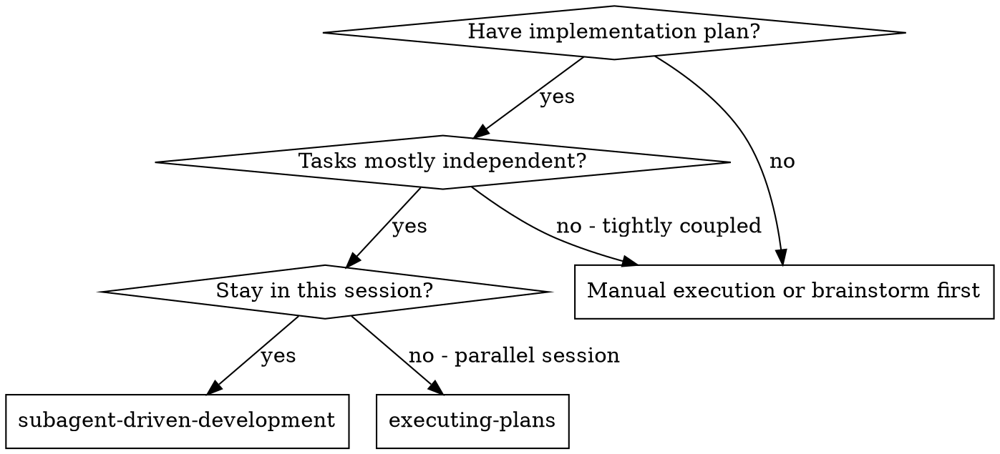
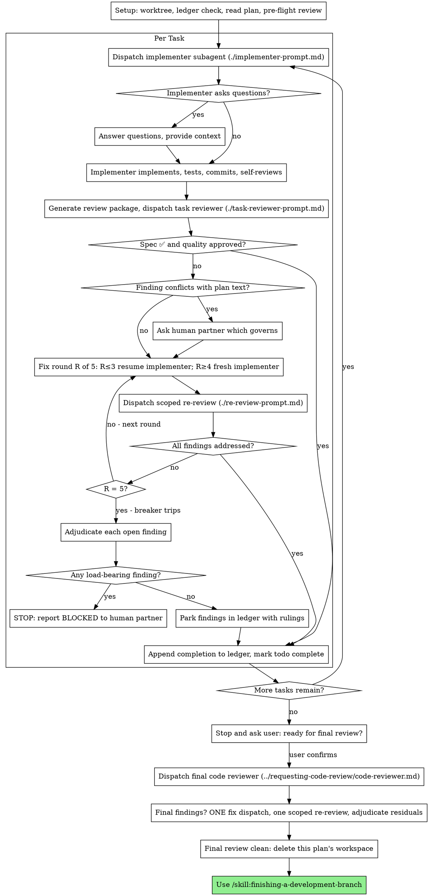

# Upstream Sync Tier 2 (2.3 + 2.4) Implementation Plan

> **REQUIRED SUB-SKILL:** Use the executing-plans skill to implement this plan task-by-task.

**Goal:** Replace the fork's two-stage Subagent-Driven Development (SDD) skill with upstream's reworked model (Option A, minus model selection), preserving the fork's end-of-plan checkpoint and `plan_tracker` integration.

**Architecture:** Wholesale content port of upstream's SDD SKILL.md + 3 prompt templates + 3 bash scripts, with mechanical adaptations (dispatch shape → `subagent({agent, task})`, strip model selection, `superpowers:` → `/skill:`, rewrite Claude-specific comment, keep plan_tracker + end-of-plan checkpoint). Rename `agents/spec-reviewer.md` → `agents/task-reviewer.md`. Delete the two old two-stage prompts. Update README live references (agent table + dir tree).

**Tech Stack:** Markdown skill docs, bash scripts, vitest/biome (regression only).

**Source:** `obra/superpowers` @ HEAD = commit `3dcbd5c` (v6.2.0).

**Branch:** `feat/skills-upstream-sync` (current — no new branch).

**Design spec:** `docs/superpowers/specs/2026-07-28-upstream-sync-tier2-sdd-design.md`.

**Reference map (live references to deleted/renamed files, found during planning):**
- `skills/subagent-driven-development/SKILL.md` — references `./spec-reviewer-prompt.md` + `./code-quality-reviewer-prompt.md` (being replaced wholesale).
- `README.md:260` — Bundled Agents table row `| spec-reviewer | Plan/spec compliance check | ... |` → must become `task-reviewer`.
- `README.md:331` — dir tree `spec-reviewer.md` → `task-reviewer.md`.
- `CHANGELOG.md:49,72` and `ROADMAP.md:141` — **historical records (out of scope — do NOT edit).**

---

## Phase 1 — New scripts + agent rename (foundation, no SKILL.md yet)

### Task 1: Add the 3 SDD bash scripts

**TDD scenario:** Trivial change — content port of bash scripts, no logic to test (verify by `bash -n` + manual run).

**Files:**
- Create: `skills/subagent-driven-development/scripts/sdd-workspace`
- Create: `skills/subagent-driven-development/scripts/task-brief`
- Create: `skills/subagent-driven-development/scripts/review-package`

**Step 1: Create `skills/subagent-driven-development/scripts/sdd-workspace` with this EXACT content**

(Adapted from upstream: Claude-specific comment rewritten for pi.)

```bash
#!/usr/bin/env bash
# Resolve and ensure the working-tree directory SDD uses for one plan's
# short-lived artifacts: task briefs, implementer reports, review packages,
# and the progress ledger. Print the plan directory's absolute path.
#
# One directory per plan (.superpowers/sdd/<plan-basename>/) so a follow-up
# plan in the same working tree can never read or overwrite another plan's
# artifacts. A stale ledger misread as current progress makes controllers
# skip whole task sequences — plan-scoping removes that failure structurally.
#
# The workspace lives in the working tree (not under .git/) because scratch
# artifacts should be git-ignored and outside the git object store, where
# subagents can freely write report files. A self-ignoring .gitignore at
# .superpowers/sdd/ keeps every plan's workspace out of `git status` and
# out of accidental commits without modifying any tracked file.
#
# Single source of truth for the workspace location, so task-brief and
# review-package cannot drift to different directories.
#
# Usage: sdd-workspace PLAN_FILE
set -euo pipefail

if [ $# -ne 1 ]; then
  echo "usage: sdd-workspace PLAN_FILE" >&2
  exit 2
fi

plan=$1
[ -f "$plan" ] || { echo "no such plan file: $plan" >&2; exit 2; }

slug=$(basename "$plan" .md)
[ -n "$slug" ] && [ "$slug" != "." ] && [ "$slug" != ".." ] \
  || { echo "cannot derive a workspace name from: $plan" >&2; exit 2; }

root=$(git rev-parse --show-toplevel)
base="$root/.superpowers/sdd"
dir="$base/$slug"
mkdir -p "$dir"
printf '*\n' > "$base/.gitignore"
cd "$dir" && pwd
```

**Step 2: Create `skills/subagent-driven-development/scripts/task-brief` with this EXACT content (verbatim from upstream)**

```bash
#!/usr/bin/env bash
# Extract one task's full text from an implementation plan into a file the
# implementer reads in one call, so the task text never has to be pasted
# through the controller's context.
#
# Usage: task-brief PLAN_FILE TASK_NUMBER [OUTFILE]
# Default OUTFILE: <repo-root>/.superpowers/sdd/<plan-basename>/task-<N>-brief.md
# (per plan and per worktree; concurrent runs of the SAME plan in the same
# working tree share it).
set -euo pipefail

if [ $# -lt 2 ] || [ $# -gt 3 ]; then
  echo "usage: task-brief PLAN_FILE TASK_NUMBER [OUTFILE]" >&2
  exit 2
fi

plan=$1
n=$2
[ -f "$plan" ] || { echo "no such plan file: $plan" >&2; exit 2; }

if [ $# -eq 3 ]; then
  out=$3
else
  dir=$("$(cd "$(dirname "$0")" && pwd)/sdd-workspace" "$plan")
  out="$dir/task-${n}-brief.md"
fi

awk -v n="$n" '
  /^```/ { infence = !infence }
  !infence && /^#+[ \t]+Task[ \t]+[0-9]+/ {
    intask = ($0 ~ ("^#+[ \t]+Task[ \t]+" n "([^0-9]|$)"))
  }
  intask { print }
' "$plan" > "$out"

if [ ! -s "$out" ]; then
  echo "task ${n} not found in ${plan} (no heading matching 'Task ${n}')" >&2
  exit 3
fi

echo "wrote ${out}: $(wc -l < "$out" | tr -d ' ') lines"
```

**Step 3: Create `skills/subagent-driven-development/scripts/review-package` with this EXACT content (verbatim from upstream)**

```bash
#!/usr/bin/env bash
# Generate a review package: commit list, stat summary, and the net
# diff with extended context, written to a file the reviewer reads in one
# call. Using the recorded per-task BASE (not HEAD~1) keeps multi-commit
# tasks intact.
#
# Usage: review-package PLAN_FILE BASE HEAD [OUTFILE]
# Default OUTFILE: <repo-root>/.superpowers/sdd/<plan-basename>/review-<base7>..<head7>.diff
# (named per range, so a re-review after fixes gets a distinct fresh file).
set -euo pipefail

if [ $# -lt 3 ] || [ $# -gt 4 ]; then
  echo "usage: review-package PLAN_FILE BASE HEAD [OUTFILE]" >&2
  exit 2
fi

plan=$1
base=$2
head=$3
[ -f "$plan" ] || { echo "no such plan file: $plan" >&2; exit 2; }

git rev-parse --verify --quiet "$base" >/dev/null || { echo "bad BASE: $base" >&2; exit 2; }
git rev-parse --verify --quiet "$head" >/dev/null || { echo "bad HEAD: $head" >&2; exit 2; }

if [ $# -eq 4 ]; then
  out=$4
else
  dir=$("$(cd "$(dirname "$0")" && pwd)/sdd-workspace" "$plan")
  out="$dir/review-$(git rev-parse --short "$base")..$(git rev-parse --short "$head").diff"
fi

{
  echo "# Review package: ${base}..${head}"
  echo
  echo "## Commits"
  git log --oneline "${base}..${head}"
  echo
  echo "## Files changed"
  git diff --stat "${base}..${head}"
  echo
  echo "## Diff"
  git diff -U10 "${base}..${head}"
} > "$out"

commits=$(git rev-list --count "${base}..${head}")
echo "wrote ${out}: ${commits} commit(s), $(wc -c < "$out" | tr -d ' ') bytes"
```

**Step 4: Make scripts executable + syntax check**

Run:
```bash
chmod +x skills/subagent-driven-development/scripts/sdd-workspace skills/subagent-driven-development/scripts/task-brief skills/subagent-driven-development/scripts/review-package
bash -n skills/subagent-driven-development/scripts/sdd-workspace
bash -n skills/subagent-driven-development/scripts/task-brief
bash -n skills/subagent-driven-development/scripts/review-package
```
Expected: all `bash -n` succeed (no syntax errors).

**Step 5: Functional smoke test (manual end-to-end)**

Use this plan file itself as the test plan (it has `### Task 1:` headings):
```bash
PLAN=docs/superpowers/plans/2026-07-28-upstream-sync-tier2-sdd.md
WS=$(./skills/subagent-driven-development/scripts/sdd-workspace "$PLAN")
echo "workspace: $WS"
ls -la "$WS"  # exists
cat .superpowers/sdd/.gitignore  # contains "*"
./skills/subagent-driven-development/scripts/task-brief "$PLAN" 1
ls "$WS"/task-1-brief.md  # exists, non-empty
BASE=$(git rev-parse HEAD)
./skills/subagent-driven-development/scripts/review-package "$PLAN" "$BASE" "$BASE"
ls "$WS"/review-*.diff  # exists
rm -rf .superpowers/sdd  # clean up the smoke-test workspace
```
Expected: workspace created, `.gitignore` written, task-1-brief.md extracted, review diff written. Then clean up.

**Step 6: Run regression**

Run: `npm test` (expect 40 files / 380 tests pass) and `npm run lint` (expect clean).

**Step 7: Commit**

```bash
git add skills/subagent-driven-development/scripts/sdd-workspace \
        skills/subagent-driven-development/scripts/task-brief \
        skills/subagent-driven-development/scripts/review-package
git commit -m "feat(sdd): add workspace, task-brief, and review-package scripts

Port the context-hygiene + plan-scoped ledger machinery from obra/superpowers:
sdd-workspace (per-plan git-ignored scratch dir), task-brief (extract one
task's text to a file), review-package (commit list + diff to a file).
Adapted the sdd-workspace comment (drop Claude-specific rationale)."
```

---

### Task 2: Rename `agents/spec-reviewer.md` → `agents/task-reviewer.md`

**TDD scenario:** Trivial change — rename + content edit, no logic.

**Files:**
- Rename: `agents/spec-reviewer.md` → `agents/task-reviewer.md`
- Modify: `agents/task-reviewer.md` (frontmatter + body)

**Step 1: Create `agents/task-reviewer.md` with this EXACT content** (then delete the old file)

```markdown
---
name: task-reviewer
description: Review one task: spec compliance + code quality (read-only)
tools: read, bash, find, grep, ls
model: claude-sonnet-4-5
---

You are a task reviewer. You review one task's implementation in two parts: spec compliance first, then code quality.

## Boundaries

- **Read code, run git commands, run focused tests: yes**
- **Edit, create, or delete any files: NO**
- You are a reviewer. Your output is a written report. You never touch the code.

## Spec Compliance

Check the implementation against the provided requirements.
- Identify missing requirements.
- Identify scope creep / unrequested changes.
- Point to exact files/lines.

## Code Quality

Check for: clean separation of concerns, proper error handling, DRY without premature abstraction, edge cases handled, tests verify real behavior (not mocks), file structure follows the plan.

## Output

Begin directly with the spec-compliance verdict. Every line is a verdict, a finding with file:line, or a check you ran — no preamble, no process narration, no closing summary.

### Spec Compliance
- ✅ Spec compliant | ❌ Issues found: [what's missing/extra/misunderstood, with file:line]
- ⚠️ Cannot verify from diff: [requirements you could not verify from the diff alone]

### Strengths
[What's well done? Be specific.]

### Issues
#### Critical (Must Fix)
#### Important (Should Fix)
#### Minor (Nice to Have)

### Assessment
**Task quality:** [Approved | Needs fixes]
**Reasoning:** [1-2 sentence technical assessment]
```

**Step 2: Delete the old file**

Run: `git rm agents/spec-reviewer.md`

**Step 3: Verify**

- `ls agents/task-reviewer.md` → exists.
- `ls agents/spec-reviewer.md` → does not exist.
- `head -3 agents/task-reviewer.md` → frontmatter has `name: task-reviewer`, `description: Review one task: spec compliance + code quality (read-only)`.
- `grep -rn "spec-reviewer" agents/` → no matches.

**Step 4: Run regression**

Run: `npm test` and `npm run lint` — both pass.

**Step 5: Commit**

```bash
git add agents/task-reviewer.md agents/spec-reviewer.md
git commit -m "refactor(agents): rename spec-reviewer to task-reviewer

The unified task reviewer replaces the fork's two-stage spec-then-quality
split: one reviewer reads the diff once and returns both verdicts. Read-only
tool set unchanged."
```

---

## Phase 2 — Replace the SDD skill content (prompts + SKILL.md)

### Task 3: Add `task-reviewer-prompt.md` and `re-review-prompt.md`

**TDD scenario:** Trivial change — content port (adapted: dispatch shape + model-selection stripped).

**Files:**
- Create: `skills/subagent-driven-development/task-reviewer-prompt.md`
- Create: `skills/subagent-driven-development/re-review-prompt.md`

**Step 1: Create `skills/subagent-driven-development/task-reviewer-prompt.md` with this EXACT content**

(Adapted from upstream: the `Subagent (general-purpose):` + `model:` block replaced with the fork's `subagent({ agent, task })` form + the `[MODEL]` placeholder + "choose per Model Selection" language stripped. Body prompt text verbatim. Placeholders section updated to drop `[MODEL]`.)

```markdown
# Task Reviewer Prompt Template

Use this template when dispatching a task reviewer subagent. The reviewer
reads the task's diff once and returns two verdicts: spec compliance and
code quality.

**Purpose:** Verify one task's implementation matches its requirements (nothing
more, nothing less) and is well-built (clean, tested, maintainable)

```
Dispatch a subagent with this prompt:
  subagent({ agent: "task-reviewer", task: `
    You are reviewing one task's implementation: first whether it matches its
    requirements, then whether it is well-built. This is a task-scoped gate,
    not a merge review — a broad whole-branch review happens separately after
    all tasks are complete.

    ## What Was Requested

    Read the task brief: [BRIEF_FILE]

    Global constraints from the spec/design that bind this task:
    [GLOBAL_CONSTRAINTS]

    ## What the Implementer Claims They Built

    Read the implementer's report: [REPORT_FILE]

    ## Diff Under Review

    **Base:** [BASE_SHA]
    **Head:** [HEAD_SHA]
    **Diff file:** [DIFF_FILE]

    Read the diff file once — it contains the commit list, a stat summary,
    and the full diff with surrounding context, and it is your view of the
    change. The diff's context lines ARE the changed files: do not Read a
    changed file separately unless a hunk you must judge is cut off
    mid-function — and say so in your report. Do not re-run git commands.
    If the diff file is missing, fetch the diff yourself:
    `git diff --stat [BASE_SHA]..[HEAD_SHA]` and `git diff [BASE_SHA]..[HEAD_SHA]`.
    Do not crawl the broader codebase. Inspect code outside the diff only
    to evaluate a concrete risk you can name — one focused check per named
    risk, and name both the risk and what you checked in your report.
    Cross-cutting changes are legitimate named risks: if the diff changes
    lock ordering, a function or API contract, or shared mutable state,
    checking the call sites is the right method.

    Your review is read-only on this checkout. Do not mutate the working
    tree, the index, HEAD, or branch state in any way.

    ## Do Not Trust the Report

    Treat the implementer's report as unverified claims about the code. It
    may be incomplete, inaccurate, or optimistic. Verify the claims against
    the diff. Design rationales in the report are claims too: "left it per
    YAGNI," "kept it simple deliberately," or any other justification is the
    implementer grading their own work. Judge the code on its merits — a
    stated rationale never downgrades a finding's severity.

    ## Tests

    The implementer already ran the tests and reported results with TDD
    evidence for exactly this code. Do not re-run the suite to confirm their
    report. Run a test only when reading the code raises a specific doubt
    that no existing run answers — and then a focused test, never a
    package-wide suite, race detector run, or repeated/high-count loop. If
    heavy validation seems warranted, recommend it in your report instead of
    running it. If you cannot run commands in this environment, name the
    test you would run.

    Warnings or other noise in the implementer's reported test output are
    findings — test output should be pristine.

    ## Part 1: Spec Compliance

    Compare the diff against What Was Requested:

    - **Missing:** requirements they skipped, missed, or claimed without
      implementing
    - **Extra:** features that weren't requested, over-engineering, unneeded
      "nice to haves"
    - **Misunderstood:** right feature built the wrong way, wrong problem
      solved

    If a requirement cannot be verified from this diff alone (it lives in
    unchanged code or spans tasks), report it as a ⚠️ item instead of
    broadening your search.

    ## Part 2: Code Quality

    **Code quality:**
    - Clean separation of concerns?
    - Proper error handling?
    - DRY without premature abstraction?
    - Edge cases handled?

    **Tests:**
    - Do the new and changed tests verify real behavior, not mocks?
    - Are the task's edge cases covered?

    **Structure:**
    - Does each file have one clear responsibility with a well-defined interface?
    - Are units decomposed so they can be understood and tested independently?
    - Is the implementation following the file structure from the plan?
    - Did this change create new files that are already large, or
      significantly grow existing files? (Don't flag pre-existing file
      sizes — focus on what this change contributed.)

    Your report should point at evidence: file:line references for every
    finding and for any check you would otherwise answer with a bare
    "yes." A tight report that cites lines gives the controller everything
    it needs.

    Your final message is the report itself: begin directly with the
    spec-compliance verdict. Every line is a verdict, a finding with
    file:line, or a check you ran — no preamble, no process narration,
    no closing summary.

    ## Calibration

    Categorize issues by actual severity. Not everything is Critical.
    Important means this task cannot be trusted until it is fixed: incorrect
    or fragile behavior, a missed requirement, or maintainability damage you
    would block a merge over — verbatim duplication of a logic block,
    swallowed errors, tests that assert nothing. "Coverage could be broader"
    and polish suggestions are Minor.
    If the plan or brief explicitly mandates something this rubric calls a
    defect (a test that asserts nothing, verbatim duplication of a logic
    block), that IS a finding — report it as Important, labeled
    plan-mandated. The plan's authorship does not grade its own work; the
    human decides.
    Acknowledge what was done well before listing issues — accurate praise
    helps the implementer trust the rest of the feedback.

    ## Output Format

    ### Spec Compliance

    - ✅ Spec compliant | ❌ Issues found: [what's missing/extra/misunderstood,
      with file:line references]
    - ⚠️ Cannot verify from diff: [requirements you could not verify from the
      diff alone, and what the controller should check — report alongside the
      ✅/❌ verdict for everything you could verify]

    ### Strengths
    [What's well done? Be specific.]

    ### Issues

    #### Critical (Must Fix)
    #### Important (Should Fix)
    #### Minor (Nice to Have)

    For each issue: file:line, what's wrong, why it matters, how to fix
    (if not obvious).

    ### Assessment

    **Task quality:** [Approved | Needs fixes]

    **Reasoning:** [1-2 sentence technical assessment]
  ` })
```

**Placeholders:**
- `[BRIEF_FILE]` — REQUIRED: the task brief file (`scripts/task-brief PLAN N`
  prints the path; same file the implementer worked from)
- `[GLOBAL_CONSTRAINTS]` — the binding requirements copied verbatim from
  the plan's Global Constraints section or the spec: exact values, formats,
  and stated relationships between components (not process rules — those
  are already in this template)
- `[REPORT_FILE]` — REQUIRED: the file the implementer wrote its detailed
  report to
- `[BASE_SHA]` — commit before this task
- `[HEAD_SHA]` — current commit
- `[DIFF_FILE]` — REQUIRED: the path the controller wrote the review
  package to (`scripts/review-package PLAN_FILE BASE HEAD` prints the unique
  path it wrote; the package never enters the controller's context)

**Reviewer returns:** Spec Compliance verdict (✅/❌/⚠️), Strengths, Issues
(Critical/Important/Minor), Task quality verdict
```

**Step 2: Create `skills/subagent-driven-development/re-review-prompt.md` with this EXACT content**

(Adapted: dispatch shape converted, `[MODEL]` stripped.)

```markdown
# Scoped Re-Review Prompt Template

Use this template when dispatching a re-review after a fix round. The
re-reviewer verifies the findings were addressed and checks the fix diff for
new breakage. It is not a fresh review — the full review already happened.

**Purpose:** Verify each finding from the previous review was addressed, and
that the fix itself broke nothing.

```
Dispatch a subagent with this prompt:
  subagent({ agent: "code-reviewer", task: `
    You are re-reviewing one task's fix round. A previous review produced
    findings; an implementer has attempted to fix them. Your job is to
    verdict each finding and inspect the fix diff — nothing else.

    ## The Task

    Read the task brief: [BRIEF_FILE]

    ## The Findings Under Verification

    [FINDINGS]

    ## The Fix

    Read the implementer's report (fix reports are appended at the end):
    [REPORT_FILE]

    **Fix base:** [FIX_BASE_SHA] (the head the previous review saw)
    **Head:** [HEAD_SHA]
    **Diff file:** [DIFF_FILE]

    Read the diff file once — it contains the fix commits, a stat summary,
    and the fix diff with surrounding context. Do not re-run git commands.
    If the diff file is missing, fetch the diff yourself:
    `git diff --stat [FIX_BASE_SHA]..[HEAD_SHA]` and
    `git diff [FIX_BASE_SHA]..[HEAD_SHA]`.

    Your review is read-only on this checkout. Do not mutate the working
    tree, the index, HEAD, or branch state in any way.

    ## Scope

    Your scope is the findings list and the fix diff. Verdict every finding.
    Inspect the fix diff for new problems the fix itself introduced. Do NOT
    re-review code the fix did not touch: if you notice an issue entirely
    outside the fix diff, report it under Out-of-Scope Observations — it
    does not block this task and does not extend the loop. A broad
    whole-branch review happens after all tasks are complete.

    ## Tests

    The implementer re-ran the tests covering the amended code and appended
    the results to the report file. Treat the report as unverified claims:
    confirm the fix report names the covering tests and shows their output,
    and verify the claims against the diff. Do not re-run the suite to
    confirm their report. Run a test only when reading the code raises a
    specific doubt that no existing run answers — and then a focused test,
    never a package-wide suite.

    ## Output Format

    Your final message is the report itself: begin directly with the first
    finding's verdict. Every line is a verdict, a finding with file:line,
    or a check you ran — no preamble, no process narration.

    ### Finding Verdicts

    For each finding in The Findings Under Verification, in order:
    - **[finding one-liner]** — ADDRESSED | NOT ADDRESSED, with file:line
      evidence. "Attempted" is not addressed: the specific defect must no
      longer exist.

    ### New Breakage in the Fix Diff

    Anything the fix itself broke or introduced, with severity
    (Critical/Important/Minor) and file:line. "None" if clean.

    ### Out-of-Scope Observations

    Issues you noticed entirely outside the fix diff. Non-blocking; the
    controller ledgers these for the final review. "None" if none.

    ### Verdict

    **Fix round:** [All findings addressed, no new Critical/Important
    breakage | Findings remain open] — list the open ones.
  ` })
```

**Placeholders:**
- `[BRIEF_FILE]` — the task brief file (same file the implementer worked from)
- `[FINDINGS]` — the Critical/Important findings and spec gaps from the
  previous review, copied verbatim, one per bullet
- `[REPORT_FILE]` — the implementer's report file (fix reports appended)
- `[FIX_BASE_SHA]` — the head the previous review saw
- `[HEAD_SHA]` — current commit
- `[DIFF_FILE]` — the path `scripts/review-package PLAN_FILE FIX_BASE HEAD` printed

**Re-reviewer returns:** per-finding verdicts (ADDRESSED / NOT ADDRESSED),
new breakage in the fix diff, out-of-scope observations, and a round verdict.
```

**Step 3: Verify**

- `grep -c "Subagent (general-purpose)" skills/subagent-driven-development/task-reviewer-prompt.md skills/subagent-driven-development/re-review-prompt.md` → `0` (dispatch shape converted).
- `grep -c "\[MODEL\]\|Model Selection" skills/subagent-driven-development/task-reviewer-prompt.md skills/subagent-driven-development/re-review-prompt.md` → `0` (model selection stripped).
- `grep -c 'subagent({ agent:' skills/subagent-driven-development/task-reviewer-prompt.md skills/subagent-driven-development/re-review-prompt.md` → `1` each (fork dispatch form present).

**Step 4: Run regression**

Run: `npm test` and `npm run lint` — both pass.

**Step 5: Commit**

```bash
git add skills/subagent-driven-development/task-reviewer-prompt.md \
        skills/subagent-driven-development/re-review-prompt.md
git commit -m "feat(sdd): add task-reviewer and re-review prompt templates

Unified task reviewer (spec + quality in one pass) and scoped re-reviewer
(fix-round verdicts). Adapted from obra/superpowers: dispatch shape
converted to subagent({agent, task}), model-selection language stripped."
```

---

### Task 4: Replace `implementer-prompt.md` with the richer version

**TDD scenario:** Trivial change — content port (adapted: dispatch shape + model stripped).

**Files:**
- Modify: `skills/subagent-driven-development/implementer-prompt.md` (replace entire contents)

**Step 1: Replace `skills/subagent-driven-development/implementer-prompt.md` with this EXACT content**

(Adapted: dispatch shape converted, `[MODEL]` + "more capable model" language stripped. Body verbatim.)

```markdown
# Implementer Subagent Prompt Template

Use this template when dispatching an implementer subagent.

```
Dispatch a subagent with this prompt:
  subagent({ agent: "implementer", task: `
    You are implementing Task N: [task name]

    ## Task Description

    Read your task brief first: [BRIEF_FILE]
    It contains the full task text from the plan.

    ## Context

    [Scene-setting: where this fits, dependencies, architectural context]

    ## Before You Begin

    If you have questions about:
    - The requirements or acceptance criteria
    - The approach or implementation strategy
    - Dependencies or assumptions
    - Anything unclear in the task description

    **Ask them now.** Raise any concerns before starting work.

    ## Your Job

    Once you're clear on requirements:
    1. Implement exactly what the task specifies
    2. Write tests (following TDD if task says to)
    3. Verify implementation works
    4. Commit your work
    5. Self-review (see below)
    6. Report back

    Work from: [directory]

    **While you work:** If you encounter something unexpected or unclear, **ask questions**.
    It's always OK to pause and clarify. Don't guess or make assumptions.

    While iterating, run the focused test for what you're changing; run the
    full suite once before committing, not after every edit.

    ## Code Organization

    You reason best about code you can hold in context once, and your edits are more
    reliable when files are focused. Keep this in mind:
    - Follow the file structure defined in the plan
    - Each file should have one clear responsibility with a well-defined interface
    - If a file you're creating is growing beyond the plan's intent, stop and report
      it as DONE_WITH_CONCERNS — don't split files on your own without plan guidance
    - If an existing file you're modifying is already large or tangled, work carefully
      and note it as a concern in your report
    - In existing codebases, follow established patterns. Improve code you're touching
      the way a good developer would, but don't restructure things outside your task.

    ## When You're in Over Your Head

    It is always OK to stop and say "this is too hard for me." Bad work is worse than
    no work. You will not be penalized for escalating.

    **STOP and escalate when:**
    - The task requires architectural decisions with multiple valid approaches
    - You need to understand code beyond what was provided and can't find clarity
    - You feel uncertain about whether your approach is correct
    - The task involves restructuring existing code in ways the plan didn't anticipate
    - You've been reading file after file trying to understand the system without progress

    **How to escalate:** Report back with status BLOCKED or NEEDS_CONTEXT. Describe
    specifically what you're stuck on, what you've tried, and what kind of help you need.
    The controller can provide more context, re-dispatch, or break the task into
    smaller pieces.

    ## Before Reporting Back: Self-Review

    Review your work with fresh eyes. Ask yourself:

    **Completeness:**
    - Did I fully implement everything in the spec?
    - Did I miss any requirements?
    - Are there edge cases I didn't handle?

    **Quality:**
    - Is this my best work?
    - Are names clear and accurate (match what things do, not how they work)?
    - Is the code clean and maintainable?

    **Discipline:**
    - Did I avoid overbuilding (YAGNI)?
    - Did I only build what was requested?
    - Did I follow existing patterns in the codebase?

    **Testing:**
    - Do tests actually verify behavior (not just mock behavior)?
    - Did I follow TDD if required?
    - Are tests comprehensive?
    - Is the test output pristine (no stray warnings or noise)?

    If you find issues during self-review, fix them now before reporting.

    ## After Review Findings

    If the task review finds issues, you will be resumed with the findings.
    Fix them, re-run the tests that cover the amended code, and append a fix
    report to your report file: what you changed, the covering tests you
    ran, the command, and the output. Reviewers will not re-run tests for
    you — your report is the test evidence. Then reply with the same short
    status contract as your first report.

    ## Report Format

    Write your full report to [REPORT_FILE]:
    - What you implemented (or what you attempted, if blocked)
    - What you tested and test results
    - **TDD Evidence** (if TDD was required for this task):
      - RED: command run, relevant failing output before implementation, and why the failure was expected
      - GREEN: command run and relevant passing output after implementation
    - Files changed
    - Self-review findings (if any)
    - Any issues or concerns

    Then report back with ONLY (under 15 lines — the detail lives in the
    report file):
    - **Status:** DONE | DONE_WITH_CONCERNS | BLOCKED | NEEDS_CONTEXT
    - Commits created (short SHA + subject)
    - One-line test summary (e.g. "14/14 passing, output pristine")
    - Your concerns, if any
    - The report file path

    If BLOCKED or NEEDS_CONTEXT, put the specifics in the final message
    itself — the controller acts on it directly.

    Use DONE_WITH_CONCERNS if you completed the work but have doubts about correctness.
    Use BLOCKED if you cannot complete the task. Use NEEDS_CONTEXT if you need
    information that wasn't provided. Never silently produce work you're unsure about.
  ` })
```

**Placeholders:**
- `[BRIEF_FILE]` — REQUIRED: the task brief file (`scripts/task-brief PLAN N`
  prints the path)
- `[REPORT_FILE]` — REQUIRED: the file the implementer writes its full report to
  (name after the brief: brief `…/task-N-brief.md` → report `…/task-N-report.md`)
- `[task name]`, `[Context …]`, `[directory]` — fill per task

**Implementer returns:** short status contract (Status, commits, one-line test
summary, concerns, report file path) — full report lives in the report file.
```

**Step 2: Verify**

- `grep -c "Subagent (general-purpose)\|\[MODEL\]\|Model Selection\|more capable model" skills/subagent-driven-development/implementer-prompt.md` → `0`.
- `grep -c 'subagent({ agent: "implementer"' skills/subagent-driven-development/implementer-prompt.md` → `1`.
- `grep -c "TDD Evidence\|DONE_WITH_CONCERNS\|When You're in Over Your Head" skills/subagent-driven-development/implementer-prompt.md` → `3` (richer content present).

**Step 3: Run regression**

Run: `npm test` and `npm run lint` — both pass.

**Step 4: Commit**

```bash
git add skills/subagent-driven-development/implementer-prompt.md
git commit -m "feat(sdd): richer implementer prompt (report-file contract, TDD evidence, escalation)

Port upstream's implementer-prompt.md: report-file contract (write full
report to a file, return <15-line status), structured TDD evidence (RED/GREEN),
'When You're in Over Your Head' escalation, code-organization guidance.
Adapted: dispatch shape converted, model-selection language stripped."
```

---

### Task 5: Replace `SKILL.md` with the reworked model (the core change)

**TDD scenario:** Trivial change — content port (heavily adapted: dispatch shape, model selection stripped, skill refs converted, plan_tracker + end-of-plan checkpoint preserved, final-review path adapted).

**Files:**
- Modify: `skills/subagent-driven-development/SKILL.md` (replace entire contents, 261 → ~470 lines)

**Step 1: Replace `skills/subagent-driven-development/SKILL.md` with this EXACT content**

```markdown
---
name: subagent-driven-development
description: Use when executing implementation plans with independent tasks in the current session
---

> **Related skills:** Need an isolated workspace? `/skill:using-git-worktrees`. Need a plan first? `/skill:writing-plans`. Done? `/skill:finishing-a-development-branch`.

# Subagent-Driven Development

Execute plan by dispatching a fresh implementer subagent per task, a task review (spec compliance + code quality) after each, and a broad whole-branch review at the end.

**Why subagents:** You delegate tasks to specialized agents with isolated context. By precisely crafting their instructions and context, you ensure they stay focused and succeed at their task. They should never inherit your session's context or history — you construct exactly what they need. This also preserves your own context for coordination work.

**Core principle:** Fresh subagent per task + task review (spec + quality) + broad final review = high quality, fast iteration

If a tool result contains a ⚠️ workflow warning, stop immediately and address it before continuing.

## Prerequisites
- Active branch (not main) or user-confirmed intent to work on main
- Approved plan or clear task scope

**Narration:** between tool calls, narrate at most one short line — the
ledger and the tool results carry the record.

**Continuous execution:** Do not pause to check in with your human partner between tasks. Execute all tasks from the plan without stopping. The only reasons to stop are: BLOCKED status you cannot resolve, ambiguity that genuinely prevents progress, or all tasks complete. "Should I continue?" prompts and progress summaries waste their time — they asked you to execute the plan, so execute the plan.

## When to Use



**vs. Executing Plans (parallel session):**
- Same session (no context switch)
- Fresh subagent per task (no context pollution)
- Review after each task (spec compliance + code quality), broad review at the end
- Faster iteration (no human-in-loop between tasks)

**Dependent tasks:** Most real plans have some dependencies. For dependent tasks, include the previous task's implementation summary and relevant file paths in the next subagent's context. Track what each completed task produced so you can pass it forward.

## The Process



## Setup

Ensure the work happens in an isolated workspace: use
`/skill:using-git-worktrees` to create one or verify the existing one.
Never start implementation on a main/master branch without your human
partner's explicit consent.

Conversation memory does not survive compaction. In real sessions,
controllers that lost their place have re-dispatched entire completed task
sequences — the single most expensive failure observed. Track progress in
a ledger file, not only in todos.

- Each plan owns a workspace: at skill start, run this skill's
  `scripts/sdd-workspace PLAN_FILE` — it prints the plan's git-ignored
  directory (`<repo-root>/.superpowers/sdd/<plan-basename>/`), home to
  every artifact for THIS plan: ledger, briefs, reports, review packages.
  Another plan's directory is never yours to read or write.
- Check for this plan's ledger at `<workspace>/progress.md`. If its first
  line names your plan file, tasks with a `Task <N>: complete` line are DONE
  — do not re-dispatch them; resume at the first task without one. A task
  whose last line is a fix round is mid-loop: resume the loop at the next
  round. A ledger whose first line names a different plan file — or a stray
  ledger at the old flat path `.superpowers/sdd/progress.md` — is another
  plan's progress: leave it in place and start your own, fresh.
- Create the ledger with its identity as the first line:
  `# SDD ledger — plan: <plan file path>`.
- The ledger is your recovery map: the commits it names exist in git even
  when your context no longer remembers creating them. After compaction,
  trust the ledger and `git log` over your own recollection.
- `git clean -fdx` will destroy the workspace (it's git-ignored scratch); if
  that happens, recover from `git log`.

Read the plan once, note its context and Global Constraints, and create a
todo per task via the `plan_tracker` tool.

Before dispatching Task 1, scan the plan once for conflicts:

- tasks that contradict each other or the plan's Global Constraints
- anything the plan explicitly mandates that the review rubric treats as a
  defect (a test that asserts nothing, verbatim duplication of a logic block)

Present everything you find to your human partner as one batched question —
each finding beside the plan text that mandates it, asking which governs —
before execution begins, not one interrupt per discovery mid-plan. If the
scan is clean, proceed without comment. The review loop remains the net for
conflicts that only emerge from implementation.

## The Task Loop

Everything you paste into a dispatch prompt — and everything a subagent
prints back — stays resident in your context for the rest of the session
and is re-read on every later turn. Hand artifacts over as files.

### 1. Dispatch the implementer

Record BASE (`git rev-parse HEAD`) before dispatching — the review package
and fix-round diffs need it.

- **Task brief:** before dispatching an implementer, run this skill's
  `scripts/task-brief PLAN_FILE N` — it extracts the task's full text to a
  uniquely named file and prints the path. Compose the dispatch so the
  brief stays the single source of requirements. Your dispatch should
  contain: (1) one line on where this task fits in the project; (2) the
  brief path, introduced as "read this first — it is your requirements,
  with the exact values to use verbatim"; (3) interfaces and decisions from
  earlier tasks that the brief cannot know; (4) your resolution of any
  ambiguity you noticed in the brief; (5) the report-file path and report
  contract. Exact values (numbers, magic strings, signatures, test cases)
  appear only in the brief. Never make a subagent read the whole plan file.
- **Report file:** name the implementer's report file after the brief
  (brief `…/task-N-brief.md` → report `…/task-N-report.md`) and put it in
  the dispatch prompt. The implementer writes the full report there and
  returns only status, commits, a one-line test summary, and concerns.
- A dispatch prompt describes one task, not the session's history. Do not
  paste accumulated prior-task summaries ("state after Tasks 1-3") into
  later dispatches. A fresh subagent needs its task, the interfaces it
  touches, and the global constraints. Nothing else.
- If an earlier task parked a finding in the area this task touches, carry
  a pointer to that ledger entry in the dispatch.
- Record the implementer's agent identity from the dispatch result —
  fix-loop rounds 1-3 resume this agent.
- Never dispatch multiple implementation subagents in parallel (conflicts).

Template: [implementer-prompt.md](implementer-prompt.md)

### 2. Handle the report

Implementer subagents report one of four statuses. Handle each appropriately:

**DONE:** Generate the review package (`scripts/review-package PLAN_FILE BASE HEAD`, from this skill's directory — it prints the unique file path it wrote; BASE is the commit you recorded before dispatching the implementer — never `HEAD~1`, which silently drops all but the last commit of a multi-commit task), then dispatch the task reviewer with the printed path.

**DONE_WITH_CONCERNS:** The implementer completed the work but flagged doubts. Read the concerns before proceeding. If the concerns are about correctness or scope, address them before review. If they're observations (e.g., "this file is getting large"), note them and proceed to review.

**NEEDS_CONTEXT:** The implementer needs information that wasn't provided. Provide the missing context and re-dispatch.

**BLOCKED:** The implementer cannot complete the task. Assess the blocker:
1. If it's a context problem, provide more context and re-dispatch
2. If the task requires more reasoning, re-dispatch
3. If the task is too large, break it into smaller pieces
4. If the plan itself is wrong, escalate to the human

**Never** ignore an escalation or force a retry without changes. If the implementer said it's stuck, something needs to change.

If the implementer asks questions — before starting or mid-task — answer
clearly and completely, provide additional context if needed, and don't
rush it into implementation.

### 3. Review the task

Per-task reviews are task-scoped gates. The broad review happens once, at the
final whole-branch review. Never skip the task review, and never accept a
report missing either verdict — spec compliance AND task quality are both
required. Implementer self-review never replaces the task review; both are
needed.

- Hand the reviewer its diff as a file: run this skill's
  `scripts/review-package PLAN_FILE BASE HEAD` and pass the reviewer the file path
  it prints (or, without bash: `git log --oneline`, `git diff --stat`,
  and `git diff -U10` for the range, redirected to one uniquely named
  file). The output never enters your own context, and the reviewer sees
  the commit list, stat summary, and full diff with context in one Read
  call. Use the BASE you recorded before dispatching the implementer —
  never `HEAD~1`, which silently truncates multi-commit tasks. Never
  dispatch a task reviewer without a diff file.
- **Reviewer inputs:** the task reviewer gets three paths — the same brief
  file, the report file, and the review package — plus the global
  constraints that bind the task.
- The global-constraints block you hand the reviewer is its attention
  lens. Copy the binding requirements verbatim from the plan's Global
  Constraints section or the spec: exact values, exact formats, and the
  stated relationships between components ("same layout as X", "matches
  Y"). The reviewer's template already carries the process rules (YAGNI,
  test hygiene, review method) — the constraints block is for what THIS
  project's spec demands.
- Do not add open-ended directives like "check all uses" or "run race tests
  if useful" without a concrete, task-specific reason
- Do not ask a reviewer to re-run tests the implementer already ran on the
  same code — the implementer's report carries the test evidence
- Do not pre-judge findings for the reviewer — never instruct a reviewer to
  ignore or not flag a specific issue. If you believe a finding would be a
  false positive, let the reviewer raise it and adjudicate it in the review
  loop. If the prompt you are writing contains "do not flag," "don't treat X
  as a defect," "at most Minor," or "the plan chose" — stop: you are
  pre-judging, usually to spare yourself a review loop.

The task reviewer may report "⚠️ Cannot verify from diff" items — requirements
that live in unchanged code or span tasks. These do not block the rest of the
review, but you must resolve each one yourself before marking the task
complete: you hold the plan and cross-task context the reviewer
lacks. If you confirm an item is a real gap, treat it as a failed spec
review — it enters the fix loop with the other findings.

Template: [task-reviewer-prompt.md](task-reviewer-prompt.md)

### 4. The fix loop

The loop triggers when the review reports spec ❌, any Critical or Important
finding, or a ⚠️ item you confirmed as a real gap.

Before the loop starts, two routes leave it immediately:

- Record Minor findings in the progress ledger as you go
  (`Task <N>: minor (deferred): <one-liner>`), and point the final
  whole-branch review at that list so it can triage which must be fixed
  before merge. A roll-up nobody reads is a silent discard. Minor findings
  never enter the loop.
- A finding labeled plan-mandated — or any finding that conflicts with
  what the plan's text requires — is the human's decision, like any plan
  contradiction: present the finding and the plan text, ask which governs.
  Do not dismiss the finding because the plan mandates it, and do not
  dispatch a fix that contradicts the plan without asking.

Everything else enters the loop. A fix round is one fix dispatch plus one
scoped re-review. Five rounds maximum per task:

**Rounds 1-3 — resume the original implementer.** Send it the open findings
verbatim. Its context is intact: it knows the task, the code, and its own
choices. If your harness cannot send another message to a live subagent,
dispatch a fresh implementer carrying the brief path, the report-file path,
and the findings — the report file is the persistent memory either way.

**Rounds 4-5 — dispatch a fresh implementer**, with the brief path, the
report-file path, the open findings, and this framing: "A prior implementer
attempted this task [N] times; you own it now. Read the report file for what
was tried." A loop that survives three resumes usually means the
implementer cannot see its own problem — fresh eyes in one move.

**Every round, either way:** the implementer fixes, re-runs the tests
covering the amended code, appends its fix report to the same report file,
and returns the short contract. Before re-dispatching the reviewer, confirm
the fix report contains the covering tests, the command run, and the
output; dispatch the re-review once all three are present. Name the
covering test files in the fix message — a one-line fix does not need the
whole suite.

**The re-review is scoped.** Run `scripts/review-package PLAN_FILE FIX_BASE HEAD`
where FIX_BASE is the head the previous review saw, and dispatch
[re-review-prompt.md](re-review-prompt.md) with the findings list, the
brief, the report file, and the printed diff path. The re-reviewer verdicts
each finding ADDRESSED or NOT ADDRESSED and flags new breakage in the fix
diff only. New Critical/Important breakage in the fix diff joins the open
findings list. Out-of-scope observations go to the ledger as deferred
minors — they never extend the loop.

**After each round,** append to the ledger:
`Task <N>: fix round <R>/5 (<X> addressed, <Y> open — <finding one-liners>; commits <a7>..<b7>)`

Never fix findings yourself in the controller session — your context stays
clean for coordination, and controller fixes skip review.

**The breaker.** When round 5's re-review still leaves findings open, stop
dispatching. Adjudicate each open finding yourself — you hold the plan and
the cross-task context the reviewer lacks:

- **The reviewer is wrong, or the point is contestable:** park it —
  `Task <N>: parked — <finding> — ruling: <why the code stands>`. The final
  review sees both sides.
- **Real, but nothing downstream builds on it:** park it the same way, with
  a ruling that says it's real and deferred.
- **Real and load-bearing** — a later task builds on it, or it reveals a
  plan defect: STOP. Append `Task <N>: BLOCKED — <reason>` and report to
  your human partner with the finding, the plan text it collides with, and
  the fix history. Parking a structural failure lets every dependent task
  build on it and hands the final review a problem it cannot fix either.

Adjudicate only at the cap. Adjudicating earlier to end a loop is
pre-judging with a different name. Every adjudication is a ledger entry —
a silent discard is forbidden.

### 5. Complete the task

When the review comes back clean — or every open finding is parked with a
ruling at the cap — append the completion line to the ledger in the same
message as your other bookkeeping:

- `Task <N>: complete (commits <base7>..<head7>, review clean)`
- `Task <N>: complete (commits <base7>..<head7>, <K> parked)` after a
  tripped breaker

Then mark the todo complete via the `plan_tracker` tool and move on. Never
move to the next task while the review has open Critical/Important issues
that are neither fixed nor parked-with-ruling at the cap.

## After All Tasks Complete

When all tasks are done and reviewed, **stop and report to the user**:

1. Summarize what was implemented (tasks completed, files changed, test counts)
2. Ask: "All tasks complete. Ready for final review and finishing?"
3. **Wait for user confirmation before proceeding**

Do NOT automatically dispatch final review or start the finishing skill. The user may want to test manually, adjust scope, or take a break before the final phase.

## Final Review

After the user confirms, the final whole-branch review gets a package too:
run `scripts/review-package PLAN_FILE MERGE_BASE HEAD` (MERGE_BASE is the
branch point) and dispatch the `code-reviewer` agent with the
[code-reviewer.md](../requesting-code-review/code-reviewer.md) template from
the requesting-code-review skill, passing the printed package path.

Final review findings get ONE fix dispatch (a fresh implementer) plus one
scoped re-review, then adjudicate any residuals with the breaker rules
above. When the final review is clean, delete this plan's workspace (the
record now lives in git) and use `/skill:finishing-a-development-branch`.

## When a Subagent Fails

**You are the orchestrator. You do NOT write code. You dispatch subagents that write code.**

If an implementer subagent fails, errors out, or produces incomplete work:

1. **Attempt 1:** Dispatch a NEW fix subagent with specific instructions about what went wrong and what needs to change. Include the error output and the original task text.
2. **Attempt 2:** If the fix subagent also fails, dispatch one more with a different approach or simplified scope.
3. **After 2 failed attempts: STOP.** Report the failure to the user and ask how to proceed. The task likely needs redesign.

**NEVER:**
- Write code yourself to "help" or "finish up" — you are the orchestrator, not an implementer
- Try to fix the subagent's work inline — this pollutes your context and defeats the fresh-subagent model
- Silently skip the failed task and move on
- Reduce quality gates (skip reviews) because a task is "almost done"

## Red Flags

**Never:**
- Start implementation on main/master branch without explicit user consent
- Skip the task review (spec + quality)
- Proceed with unfixed issues that are neither fixed nor parked-with-ruling
- Dispatch multiple implementation subagents in parallel (conflicts)
- Make a subagent read the plan file (hand it the brief file instead)
- Skip scene-setting context (subagent needs to understand where task fits)
- Ignore subagent questions (answer before letting them proceed)
- Accept "close enough" on spec compliance
- Skip review loops (reviewer found issues = implementer fixes = re-review)
- Let implementer self-review replace the task review (both are needed)
- Move to the next task while the review has open Critical/Important issues
- Pre-judge findings for a reviewer ("do not flag", "at most Minor")
- Silently discard a finding — every adjudication is a ledger entry
- Fix findings yourself in the controller session

## Integration

**Required workflow skills:**
- **`/skill:using-git-worktrees`** - Recommended: Set up isolated workspace before starting. For small changes, branching in the current directory is acceptable with human approval.
- **`/skill:writing-plans`** - Creates the plan this skill executes
- **`/skill:requesting-code-review`** - Code review template for the final whole-branch reviewer
- **`/skill:finishing-a-development-branch`** - Complete development after final review

**Subagents follow by default:**
- **TDD** - Runtime warnings on source-before-test patterns. Implementer subagents receive three-scenario TDD instructions via agent profile and prompt template: new feature (full TDD), modifying tested code (run existing tests), trivial change (judgment call).

**Alternative workflow:**
- **`/skill:executing-plans`** - Use for parallel session instead of same-session execution
```

**Step 2: Verify**

- `grep -c "spec-reviewer\|code-quality-reviewer\|spec-reviewer-prompt\|code-quality-reviewer-prompt" skills/subagent-driven-development/SKILL.md` → `0` (old prompts gone from the skill).
- `grep -c "task-reviewer-prompt\|re-review-prompt\|implementer-prompt" skills/subagent-driven-development/SKILL.md` → `3` (new prompts wired).
- `grep -c "Subagent (general-purpose)\|\[MODEL\]\|Model Selection\|more capable model\|capability bump" skills/subagent-driven-development/SKILL.md` → `0` (model selection stripped).
- `grep -c "superpowers:" skills/subagent-driven-development/SKILL.md` → `0`.
- `grep -c "/skill:using-git-worktrees\|/skill:writing-plans\|/skill:finishing-a-development-branch\|/skill:requesting-code-review\|/skill:executing-plans" skills/subagent-driven-development/SKILL.md` → at least `5` (skill refs converted).
- `grep -c "plan_tracker" skills/subagent-driven-development/SKILL.md` → at least `2` (plan_tracker preserved: setup + complete-task).
- `grep -c "ledger\|progress.md" skills/subagent-driven-development/SKILL.md` → at least `8` (ledger machinery present).
- `grep -c "sdd-workspace\|task-brief\|review-package" skills/subagent-driven-development/SKILL.md` → at least `5` (scripts wired).
- `grep -c "Stop and ask user: ready for final review\|Wait for user confirmation before proceeding" skills/subagent-driven-development/SKILL.md` → `2` (end-of-plan checkpoint preserved).
- `grep -c "code-reviewer.md\|requesting-code-review" skills/subagent-driven-development/SKILL.md` → at least `2` (final review path adapted).

**Step 3: Run regression**

Run: `npm test` (expect 40 files / 380 tests pass) and `npm run lint` (expect clean).

**Step 4: Commit**

```bash
git add skills/subagent-driven-development/SKILL.md
git commit -m "feat(sdd): replace two-stage review with reworked unified-reviewer model

Adopt upstream's SDD lifecycle: unified task reviewer (spec + quality in one
pass), scoped re-review, 5-round fix loop with breaker + adjudication,
plan-scoped progress ledger (compaction-survival), context-hygiene scripts,
pre-flight plan-conflict scan, Global Constraints lens. Model selection
stripped (deferred). Fork adaptations: subagent({agent, task}) dispatch,
/skill: syntax, plan_tracker kept alongside ledger, end-of-plan user
checkpoint preserved, Claude-specific comment rewritten."
```

---

## Phase 3 — Cleanup + doc updates

### Task 6: Delete the old two-stage prompts; verify no stale references

**TDD scenario:** Trivial change — deletions + grep verification.

**Files:**
- Delete: `skills/subagent-driven-development/spec-reviewer-prompt.md`
- Delete: `skills/subagent-driven-development/code-quality-reviewer-prompt.md`

**Step 1: Delete the files**

Run:
```bash
git rm skills/subagent-driven-development/spec-reviewer-prompt.md
git rm skills/subagent-driven-development/code-quality-reviewer-prompt.md
```

**Step 2: Verify no live references remain**

Run: `grep -rn "spec-reviewer-prompt\|code-quality-reviewer-prompt\|spec-reviewer\b" skills/ extensions/ agents/ tests/ README.md`
Expected: no matches. (Historical `docs/plans/*`, `docs/specs/*`, `CHANGELOG.md`, `ROADMAP.md` references are out of scope — do NOT edit those. Confirm no matches in the live code dirs + README.)

Note: `agents/spec-reviewer.md` was already deleted in Task 2, and `agents/task-reviewer.md` exists. Confirm with `ls agents/` — `spec-reviewer.md` absent, `task-reviewer.md` present.

**Step 3: Verify final SDD directory contents**

Run: `ls skills/subagent-driven-development/`
Expected: `SKILL.md`, `implementer-prompt.md`, `task-reviewer-prompt.md`, `re-review-prompt.md`, `scripts/`. (No `spec-reviewer-prompt.md`, no `code-quality-reviewer-prompt.md`.)

Run: `ls skills/subagent-driven-development/scripts/`
Expected: `sdd-workspace`, `task-brief`, `review-package`.

**Step 4: Run regression**

Run: `npm test` and `npm run lint` — both pass.

**Step 5: Commit**

```bash
git add skills/subagent-driven-development/spec-reviewer-prompt.md \
        skills/subagent-driven-development/code-quality-reviewer-prompt.md
git commit -m "chore(sdd): remove obsolete two-stage reviewer prompts

spec-reviewer-prompt.md and code-quality-reviewer-prompt.md are superseded
by the unified task-reviewer-prompt.md + re-review-prompt.md."
```

---

### Task 7: Update README live references (agent table + dir tree)

**TDD scenario:** Trivial change — doc edits.

**Files:**
- Modify: `README.md` (line 260 agent table row, line 331 dir tree entry)

**Step 1: Edit README.md Bundled Agents table row (line 260)**

Change:
```
| `spec-reviewer` | Plan/spec compliance check | read, bash (read-only) | — |
```
to:
```
| `task-reviewer` | Task review: spec compliance + code quality | read, bash (read-only) | — |
```

**Step 2: Edit README.md dir tree (line 331)**

Change:
```
│   └── spec-reviewer.md               # Plan/spec compliance reviewer
```
to:
```
│   └── task-reviewer.md               # Task reviewer (spec + code quality)
```

**Step 3: Verify**

- `grep -n "spec-reviewer" README.md` → no matches (live refs updated).
- `grep -n "task-reviewer" README.md` → 2 matches (table + tree).
- `grep -n "spec-reviewer" CHANGELOG.md ROADMAP.md` → matches remain (historical, out of scope — leave them).

**Step 4: Run regression**

Run: `npm test` and `npm run lint` — both pass.

**Step 5: Commit**

```bash
git add README.md
git commit -m "docs: update README agent references (spec-reviewer → task-reviewer)

Bundled Agents table + directory tree now list task-reviewer (the unified
task reviewer) instead of the removed spec-reviewer. Historical
CHANGELOG/ROADMAP mentions left as-is."
```

---

## Verification (after all tasks)

- `npm test` — all green (40 files / 380 tests).
- `npm run lint` — clean.
- `git log --oneline -7` — seven commits, one per task.
- `skills/subagent-driven-development/` contains: `SKILL.md`, `implementer-prompt.md`, `task-reviewer-prompt.md`, `re-review-prompt.md`, `scripts/{sdd-workspace,task-brief,review-package}`.
- `agents/task-reviewer.md` exists; `agents/spec-reviewer.md` does not.
- No `spec-reviewer` / `code-quality-reviewer` live references in `skills/`, `extensions/`, `agents/`, `tests/`, `README.md`.
- No `[MODEL]` / "Model Selection" / "superpowers:" / "Subagent (general-purpose)" in the ported SDD content.
- Scripts pass `bash -n`.
