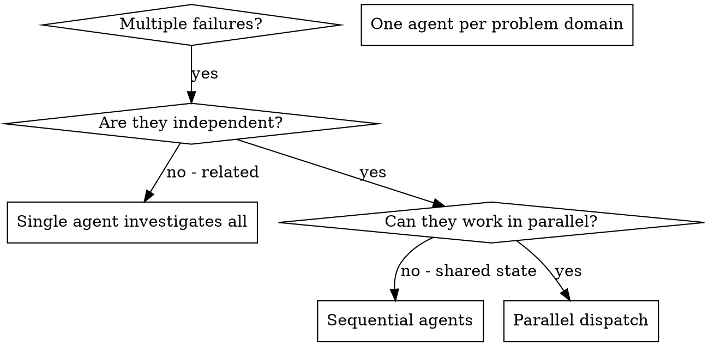

# Upstream Sync Tier 4 Implementation Plan

> **REQUIRED SUB-SKILL:** Use the executing-plans skill to implement this plan task-by-task.

**Goal:** Three-way merge the original's SKILL.md changes into the 9 remaining fork skills, preserving fork pi-adaptations (Related-skills lines, Boundaries, plan_tracker, workflow-monitor integration, `/skill:` syntax, `docs/superpowers/` paths) while adopting the original's substantive content.

**Architecture:** For big rewrites (using-git-worktrees, finishing, brainstorming, writing-plans), the original HEAD content becomes the new base with fork adaptations re-applied. For small skills, targeted edits. Cross-cutting: `superpowers:` → `/skill:`; drop recaps/social-proof (confirmed); drop references to non-existent fork assets (visual-companion.md, elements-of-style skill).

**Tech Stack:** Markdown skill docs, vitest/biome (regression only).

**Source:** `obra/superpowers` @ HEAD (v6.2.0, commit `3dcbd5c`).

**Branch:** `feat/skills-upstream-sync` (current — no new branch).

**Design spec:** `docs/superpowers/specs/2026-07-28-upstream-sync-tier4-design.md`.

**Key convergence note:** The original HEAD already uses `docs/superpowers/specs/` + `docs/superpowers/plans/` paths (same as fork). The main adaptation is `superpowers:X` → `/skill:X` in the body text.

**Two references to DROP (fork lacks these assets):**
- `visual-companion.md` (Tier 3, not ported) — in brainstorming
- `elements-of-style:writing-clearly-and-concisely` skill (doesn't exist in fork) — in brainstorming

---

## Phase 1 — Small skills (Group 1 clean fixes + Group 3 compression)

### Task 1: `systematic-debugging/SKILL.md` (small edit)

**TDD scenario:** Trivial change — content edit, no logic.

**Files:** Modify `skills/systematic-debugging/SKILL.md`

**Step 1: Apply these edits via the edit tool:**

Edit A — drop the filler line under Overview. OLD:
```
## Overview

Random fixes waste time and create new bugs. Quick patches mask underlying issues.

**Core principle:**
```
NEW:
```
## Overview

**Core principle:**
```

Edit B — add Phase 4 verification cross-ref. In Phase 4, step 3 "Verify Fix", OLD:
```
3. **Verify Fix**
   - Test passes now?
   - No other tests broken?
   - Issue actually resolved?

4. **If Fix Doesn't Work**
```
NEW:
```
3. **Verify Fix**
   - Test passes now?
   - No other tests broken?
   - Issue actually resolved?
   - Use `/skill:verification-before-completion` before claiming success

4. **If Fix Doesn't Work**
```

Edit C — fix the keyword scanner line. OLD:
```
- "Ultrathinks this" - Question fundamentals, not just symptoms
```
NEW:
```
- "Ultra-think this" - Question fundamentals, not just symptoms
```

**Step 2: Verify**
- `grep -c "Random fixes waste time" skills/systematic-debugging/SKILL.md` → 0
- `grep -c "/skill:verification-before-completion" skills/systematic-debugging/SKILL.md` → ≥1 (the new Phase 4 cross-ref; the fork's top Related-skills line also has it)
- `grep -c "Ultra-think this" skills/systematic-debugging/SKILL.md` → 1
- `grep -c "Ultrathinks this" skills/systematic-debugging/SKILL.md` → 0
- `grep -c "Real-World Impact" skills/systematic-debugging/SKILL.md` → 0 (already gone)
- `grep -c "superpowers:" skills/systematic-debugging/SKILL.md` → 0

**Step 3: Run regression** — `npm test` (40/380) + `npm run lint` (clean).

**Step 4: Commit**
```
git add skills/systematic-debugging/SKILL.md
git commit -m "feat(systematic-debugging): port SKILL.md edits from upstream

Drop overview filler line, add Phase 4 verification cross-ref
(/skill:verification-before-completion), fix 'ultrathinks' keyword scanner
trigger to 'ultra-think'. Social-proof 'Real-World Impact' already absent."
```

---

### Task 2: `verification-before-completion/SKILL.md` (compression — drop social proof + recaps)

**TDD scenario:** Trivial change — deletions.

**Files:** Modify `skills/verification-before-completion/SKILL.md`

**Step 1: Apply these edits:**

Edit A — drop the filler line. OLD:
```
## Overview

Claiming work is complete without verification is dishonesty, not efficiency.

**Core principle:** Evidence before claims, always.
```
NEW:
```
## Overview

**Core principle:** Evidence before claims, always.
```

Edit B — drop the "## Why This Matters" social-proof section (the whole block). OLD:
```
## Why This Matters

From 24 failure memories:
- your human partner said "I don't believe you" - trust broken
- Undefined functions shipped - would crash
- Missing requirements shipped - incomplete features
- Time wasted on false completion → redirect → rework
- Violates: "Honesty is a core value. If you lie, you'll be replaced."

## When To Apply
```
NEW:
```
## When To Apply
```

Edit C — drop the "## The Bottom Line" recap (at the end). OLD:
```
## The Bottom Line

**No shortcuts for verification.**

Run the command. Read the output. THEN claim the result.

This is non-negotiable.
```
NEW: (delete the entire block — it's the last section)

**IMPORTANT — preserve fork-specific content:** The fork has a workflow-monitor integration paragraph ("The workflow-monitor extension monitors `git commit`...") and a `plan_tracker` complete-step call near the end. These must NOT be deleted — they are fork-specific and appear in a different location than the dropped "The Bottom Line". Verify they survive: `grep -c "workflow-monitor extension monitors\|plan_tracker" skills/verification-before-completion/SKILL.md` → ≥2.

**Step 2: Verify**
- `grep -c "dishonesty, not efficiency" skills/verification-before-completion/SKILL.md` → 0
- `grep -c "## Why This Matters\|From 24 failure memories" skills/verification-before-completion/SKILL.md` → 0
- `grep -c "## The Bottom Line" skills/verification-before-completion/SKILL.md` → 0
- `grep -c "workflow-monitor extension monitors" skills/verification-before-completion/SKILL.md` → 1 (preserved)
- `grep -c "plan_tracker" skills/verification-before-completion/SKILL.md` → 1 (preserved)
- `grep -c "Related skills" skills/verification-before-completion/SKILL.md` → 1 (preserved)

**Step 3: Run regression** — `npm test` + `npm run lint`.

**Step 4: Commit**
```
git add skills/verification-before-completion/SKILL.md
git commit -m "refactor(verification-before-completion): drop social proof + recap (upstream compression)

Drop 'dishonesty' filler line, 'Why This Matters' social-proof section,
and 'The Bottom Line' recap — conversion-snapshot carryover the original
trimmed. Preserve fork's workflow-monitor integration + plan_tracker call."
```

---

### Task 3: `receiving-code-review/SKILL.md` (drop "The Bottom Line" recap)

**TDD scenario:** Trivial change — deletion.

**Files:** Modify `skills/receiving-code-review/SKILL.md`

**Step 1: Drop the "## The Bottom Line" recap at the end.** OLD:
```
## The Bottom Line

**External feedback = suggestions to evaluate, not orders to follow.**

Verify. Question. Then implement.

No performative agreement. Technical rigor always.
```
NEW: (delete the entire block)

**Step 2: Verify**
- `grep -c "## The Bottom Line" skills/receiving-code-review/SKILL.md` → 0
- `grep -c "Related skills" skills/receiving-code-review/SKILL.md` → 1 (preserved)
- `grep -c "superpowers:" skills/receiving-code-review/SKILL.md` → 0

**Step 3: Run regression** — `npm test` + `npm run lint`.

**Step 4: Commit**
```
git add skills/receiving-code-review/SKILL.md
git commit -m "refactor(receiving-code-review): drop 'The Bottom Line' recap (upstream compression)

Conversion-snapshot carryover the original trimmed. Substantive content
lives above the recap."
```

---

### Task 4: `dispatching-parallel-agents/SKILL.md` (context isolation + drop social proof)

**TDD scenario:** Trivial change — content edit.

**Files:** Modify `skills/dispatching-parallel-agents/SKILL.md`

This skill needs: (1) add context isolation principle, (2) drop social proof if present, (3) agent-neutral prose. The fork's current version is small. The original's HEAD version (35 lines churn) added the context-isolation principle to the Overview and dropped a "Real Example from Session" social-proof block.

**Step 1: Read the fork's current `skills/dispatching-parallel-agents/SKILL.md` and the original HEAD version (inlined below), then merge.** The original HEAD content for this skill is:

```markdown
---
name: dispatching-parallel-agents
description: Use when facing 2+ independent tasks that can be worked on without shared state or sequential dependencies
---

# Dispatching Parallel Agents

## Overview

You delegate tasks to specialized agents with isolated context. By precisely crafting their instructions and context, you ensure they stay focused and succeed at their task. They should never inherit your session's context or history — you construct exactly what they need. This also preserves your own context for coordination work.

When you have multiple unrelated failures (different test files, different subsystems, different bugs), investigating them sequentially wastes time. Each investigation is independent and can happen in parallel.

**Core principle:** Dispatch one agent per independent problem domain. Let them work concurrently.

## When to Use



**Use when:**
- 3+ test files failing with different root causes
- Multiple subsystems broken independently
- Each problem can be understood without context from others
- No shared state between investigations

**Don't use when:**
- Failures are related (fix one might fix others)
- Need to understand full system state
- Agents would interfere with each other

## The Pattern

### 1. Identify Independent Domains

Group failures by what's broken:
- File A tests: Tool approval flow
- File B tests: Batch completion behavior
- File C tests: Abort functionality

Each domain is independent - fixing tool approval doesn't affect abort tests.

### 2. Create Focused Agent Tasks

Each agent gets:
- **Specific scope:** One test file or subsystem
- **Clear goal:** Make these tests pass
- **Constraints:** Don't change other code
- **Expected output:** Summary of what you found and fixed

### 3. Dispatch in Parallel

Issue all three subagent dispatches in the same response — they run in parallel:

```text
Subagent (general-purpose): "Fix agent-tool-abort.test.ts failures"
Subagent (general-purpose): "Fix batch-completion-behavior.test.ts failures"
Subagent (general-purpose): "Fix tool-approval-race-conditions.test.ts failures"
# All three run concurrently.
```

Multiple dispatch calls in one response = parallel execution. One per response = sequential.

### 4. Review and Integrate

When agents return:
- Read each summary
- Verify fixes don't conflict
- Run full test suite
- Integrate all changes

## Agent Prompt Structure

Good agent prompts are:
1. **Focused** - One clear problem domain
2. **Self-contained** - All context needed to understand the problem
3. **Specific about output** - What should the agent return?

```markdown
Fix the 3 failing tests in src/agents/agent-tool-abort.test.ts:

1. "should abort tool with partial output capture" - expects 'interrupted at' in message
2. "should handle mixed completed and aborted tools" - fast tool aborted instead of completed
3. "should properly track pendingToolCount" - expects 3 results but gets 0

These are timing/race condition issues. Your task:

1. Read the test file and understand what each test verifies
2. Identify root cause - timing issues or actual bugs?
3. Fix by:
   - Replacing arbitrary timeouts with event-based waiting
   - Fixing bugs in abort implementation if found
   - Adjusting test expectations if testing changed behavior

Do NOT just increase timeouts - find the real issue.

Return: Summary of what you found and what you fixed.
```

## Common Mistakes

**❌ Too broad:** "Fix all the tests" - agent gets lost
**✅ Specific:** "Fix agent-tool-abort.test.ts" - focused scope

**❌ No context:** "Fix the race condition" - agent doesn't know where
**✅ Context:** Paste the error messages and test names

**❌ No constraints:** Agent might refactor everything
**✅ Constraints:** "Do NOT change production code" or "Fix tests only"

**❌ Vague output:** "Fix it" - you don't know what changed
**✅ Specific:** "Return summary of root cause and changes"

## When NOT to Use

**Related failures:** Fixing one might fix others - investigate together first
**Need full context:** Understanding requires seeing entire system
**Exploratory debugging:** You don't know what's broken yet
**Shared state:** Agents would interfere (editing same files, using same resources)

## Real Example from Session

**Scenario:** 6 test failures across 3 files after major refactoring

**Failures:**
- agent-tool-abort.test.ts: 3 failures (timing issues)
- batch-completion-behavior.test.ts: 2 failures (tools not executing)
- tool-approval-race-conditions.test.ts: 1 failure (execution count = 0)

**Decision:** Independent domains - abort logic separate from batch completion separate from race conditions

**Dispatch:**
```
Agent 1 → Fix agent-tool-abort.test.ts
Agent 2 → Fix batch-completion-behavior.test.ts
Agent 3 → Fix tool-approval-race-conditions.test.ts
```

**Results:**
- Agent 1: Replaced timeouts with event-based waiting
- Agent 2: Fixed event structure bug (threadId in wrong place)
- Agent 3: Added wait for async tool execution to complete

**Integration:** All fixes independent, no conflicts, full suite green

## Verification

After agents return:
1. **Review each summary** - Understand what changed
2. **Check for conflicts** - Did agents edit same code?
3. **Run full suite** - Verify all fixes work together
4. **Spot check** - Agents can make systematic errors
```

**Adaptation:** Add the fork's Related-skills line at the top (after frontmatter): `> **Related skills:** Debug each problem with \`/skill:systematic-debugging\`. Verify all fixes with \`/skill:verification-before-completion\`.` Convert the dispatch example's `Subagent (general-purpose):` to the fork's `subagent({ agent: "worker", task: ... })` form (the fork dispatches via the `subagent` tool, not the upstream `Subagent (general-purpose):` template). Keep the "Real Example from Session" (it's a concrete worked example, not social proof — the original kept it; the "social proof" drop was about a different block that the fork may not have).

**Step 2: Write the merged file** with: original HEAD body + fork Related-skills line + `subagent({ agent: "worker", task: ... })` dispatch form (replacing the `Subagent (general-purpose):` lines) + context-isolation principle (already in the original's Overview — "They should never inherit your session's context or history").

**Step 3: Verify**
- `grep -c "Related skills" skills/dispatching-parallel-agents/SKILL.md` → 1
- `grep -c "superpowers:" skills/dispatching-parallel-agents/SKILL.md` → 0
- `grep -c "Subagent (general-purpose)" skills/dispatching-parallel-agents/SKILL.md` → 0 (converted)
- `grep -c 'subagent({ agent:' skills/dispatching-parallel-agents/SKILL.md` → ≥1
- `grep -c "never inherit your session" skills/dispatching-parallel-agents/SKILL.md` → 1 (context isolation)

**Step 4: Run regression** — `npm test` + `npm run lint`.

**Step 5: Commit**
```
git add skills/dispatching-parallel-agents/SKILL.md
git commit -m "feat(dispatching-parallel-agents): port context-isolation + agent-neutral prose

Adopt upstream's context-isolation principle (agents never inherit session
context), convert dispatch examples to subagent({agent, task}) form.
Preserve fork Related-skills line."
```

---

### Task 5: `executing-plans/SKILL.md` (remove batch-and-stop, trim quality claim, fold Integration)

**TDD scenario:** Trivial change — content edit.

**Files:** Modify `skills/executing-plans/SKILL.md`

The original HEAD executing-plans is small (42 lines churn). The fork's version already has `/skill:` syntax, Related-skills line, plan_tracker integration, and a finishing-a-development-branch handoff. The original's changes: remove "batch-and-stop" pattern, trim a subagent quality claim, fold "Integration" skill lists into points of use, and convert "For Claude" → "For agentic workers".

**Step 1: Read the fork's current `skills/executing-plans/SKILL.md`.** Compare to the original HEAD (inlined in the design research above). Apply:
- If the fork has a "batch-and-stop" pattern (e.g., "execute a batch, then stop and ask"), remove it — the original removed this in favor of continuous execution within the plan.
- Trim any "subagent quality claim" (e.g., "subagents produce higher quality") — the original trimmed this.
- The fork already uses `/skill:` syntax (verified) and has an Integration section — fold any redundant skill lists into points of use if the original did.
- The fork already has the plan_tracker integration (verified: lines 30, 36, 39) — preserve it.
- The fork already has the finishing handoff (verified: line 57) — preserve it.

**Step 2: Verify**
- `grep -c "superpowers:" skills/executing-plans/SKILL.md` → 0
- `grep -c "Related skills" skills/executing-plans/SKILL.md` → 1 (preserved)
- `grep -c "plan_tracker" skills/executing-plans/SKILL.md` → ≥1 (preserved)
- `grep -c "batch-and-stop\|batch and stop" skills/executing-plans/SKILL.md` → 0 (if it was present)

**Step 3: Run regression** — `npm test` + `npm run lint`.

**Step 4: Commit**
```
git add skills/executing-plans/SKILL.md
git commit -m "refactor(executing-plans): port upstream trims (batch-and-stop, quality claim)

Remove batch-and-stop pattern, trim subagent quality claim. Preserve fork
plan_tracker integration + finishing handoff + /skill: syntax."
```

---

## Phase 2 — Big rewrites (Group 1/2 structural merges)

### Task 6: `using-git-worktrees/SKILL.md` (full structural rewrite)

**TDD scenario:** Trivial change — content replacement (large).

**Files:** Modify `skills/using-git-worktrees/SKILL.md`

**Step 1: Replace the entire file** with the original HEAD content (inlined in the design research above), with these adaptations:
- Add the fork's Related-skills line after frontmatter: `> **Related skills:** Set up after \`/skill:brainstorming\`. Execute with \`/skill:executing-plans\` or \`/skill:subagent-driven-development\`. Clean up with \`/skill:finishing-a-development-branch\`.`
- The original HEAD content already has the "Announce at start" line, Step 0 (detect existing isolation), Step 1a/1b (native tools vs git fallback), Step 2/3, Quick Reference table, and Common Rationalizations table. No `superpowers:` syntax in this file's body (verified — the original HEAD version doesn't use `superpowers:`; it uses plain prose).
- The original HEAD drops the old "Common Mistakes"/"Red Flags"/"Example Workflow"/"Integration" sections (converted to the rationalizations table). The fork's Integration section at the bottom (with `/skill:` refs) should be re-added as a short "## Integration" section preserving the fork's cross-skill wiring:
```markdown
## Integration

**Called by:**
- **`/skill:brainstorming`** - When design is approved and implementation follows
- **`/skill:subagent-driven-development`** - Recommended before executing any tasks
- **`/skill:executing-plans`** - Recommended before executing any tasks

**Pairs with:**
- **`/skill:finishing-a-development-branch`** - REQUIRED for cleanup after work complete
```

**Step 2: Verify**
- `grep -c "Step 0: Detect Existing Isolation" skills/using-git-worktrees/SKILL.md` → 1
- `grep -c "Common Rationalizations" skills/using-git-worktrees/SKILL.md` → 1
- `grep -c "Common Mistakes\|## Red Flags\|## Example Workflow" skills/using-git-worktrees/SKILL.md` → 0 (old guard sections gone)
- `grep -c "Related skills" skills/using-git-worktrees/SKILL.md` → 1
- `grep -c "superpowers:" skills/using-git-worktrees/SKILL.md` → 0
- `grep -c "/skill:finishing-a-development-branch" skills/using-git-worktrees/SKILL.md` → ≥1 (Integration)

**Step 3: Run regression** — `npm test` + `npm run lint`.

**Step 4: Commit**
```
git add skills/using-git-worktrees/SKILL.md
git commit -m "feat(using-git-worktrees): port restructured workspace-detection model

Adopt upstream's Step 0 (detect existing isolation), Step 1a/1b (native
tools vs git fallback), submodule guard, sandbox fallback, rationalization
table (replaces Common Mistakes/Red Flags/Example Workflow). Re-apply fork
Related-skills line + Integration section with /skill: syntax."
```

---

### Task 7: `finishing-a-development-branch/SKILL.md` (full rewrite + worktree-path fix)

**TDD scenario:** Trivial change — content replacement (large).

**Files:** Modify `skills/finishing-a-development-branch/SKILL.md`

**Step 1: Replace the entire file** with the original HEAD content (inlined in the design research above), with these adaptations:
- Add the fork's Related-skills line after frontmatter: `> **Related skills:** Verify tests pass with \`/skill:verification-before-completion\`. Consider \`/skill:requesting-code-review\` before merging.`
- The original HEAD content already includes: the worktree-path-capture fix (Step 2 captures `WORKTREE_PATH` before Step 5 changes directory), forge-agnostic PR creation (detect remote platform, use forge CLI or creation URL), the "stop offering to discard work" change (discard only on explicit request + typed 'discard' confirmation), the rationalization table, and the 6-step process. No `superpowers:` syntax in the body (verified).
- Add a short "## Integration" section at the end preserving the fork's cross-skill wiring:
```markdown
## Integration

- **`/skill:subagent-driven-development`** - After all tasks complete, this skill finishes the work
- **`/skill:executing-plans`** - After all batches complete, this skill finishes the work
- **`/skill:using-git-worktrees`** - Cleans up the worktree created by that skill
```

**Step 2: Verify**
- `grep -c "WORKTREE_PATH" skills/finishing-a-development-branch/SKILL.md` → ≥1 (worktree-path-capture fix)
- `grep -c "Common Rationalizations" skills/finishing-a-development-branch/SKILL.md` → 1
- `grep -c "discard" skills/finishing-a-development-branch/SKILL.md` → ≥1 (explicit-discard confirmation)
- `grep -c "forge" skills/finishing-a-development-branch/SKILL.md` → ≥1 (forge-agnostic PR)
- `grep -c "Related skills" skills/finishing-a-development-branch/SKILL.md` → 1
- `grep -c "superpowers:" skills/finishing-a-development-branch/SKILL.md` → 0

**Step 3: Run regression** — `npm test` + `npm run lint`.

**Step 4: Commit**
```
git add skills/finishing-a-development-branch/SKILL.md
git commit -m "feat(finishing-a-development-branch): port reworked model + worktree-path fix

Adopt upstream's 6-step process: verify tests, detect environment (with
WORKTREE_PATH capture before Step 5 cd), determine base branch, present
options, execute choice, cleanup. Forge-agnostic PR creation. Discard only
on explicit typed 'discard' confirmation. Rationalization table. Re-apply
fork Related-skills line + Integration section."
```

---

### Task 8: `brainstorming/SKILL.md` (HARD-GATE + checklist + process flow + self-review + user gate)

**TDD scenario:** Trivial change — content replacement (large, high-value).

**Files:** Modify `skills/brainstorming/SKILL.md`

**Step 1: Replace the entire file** with the original HEAD content (inlined in the design research above), with these adaptations:
- Add the fork's Related-skills line after frontmatter: `> **Related skills:** Consider \`/skill:using-git-worktrees\` to set up an isolated workspace, then \`/skill:writing-plans\` for implementation planning.`
- **DROP the visual-companion references** (fork doesn't have `visual-companion.md` — Tier 3 not ported):
  - In the Checklist, remove item 2 ("Offer the visual companion just-in-time...").
  - Remove the entire "## Visual Companion" section at the end.
  - Renumber the checklist items (1 Explore, 2 Ask clarifying questions, 3 Propose approaches, 4 Present design, 5 Write design doc, 6 Spec self-review, 7 User reviews spec, 8 Transition to implementation).
  - In the Process Flow dot graph, the visual-companion isn't referenced, so no change there.
- **DROP the `elements-of-style:writing-clearly-and-concisely` reference** in "After the Design > Documentation" (the line "Use elements-of-style:writing-clearly-and-concisely skill if available"). The fork doesn't have this skill.
- **Preserve the fork's `## Boundaries` section** (file-write boundaries enforced by workflow-monitor). Add it after the frontmatter + Related-skills line, before the `# Brainstorming Ideas Into Designs` heading — OR after the HARD-GATE. Place it right after the HARD-GATE block:
```markdown
## Boundaries
- Read code and docs: yes
- Write to docs/superpowers/specs/: yes
- Edit or create any other files: no
```
- **Preserve the fork's `plan_tracker` complete-step call.** In "After the Design > Documentation", after "Commit the design document to git", add: `- Mark the brainstorm phase complete: call \`plan_tracker\` with \`{action: "update", status: "complete"}\` for the current phase`
- The original HEAD already uses `docs/superpowers/specs/YYYY-MM-DD-<topic>-design.md` (converged with fork — no path change needed).
- Convert any `superpowers:` references in the body to `/skill:`. The original HEAD brainstorming body references "writing-plans skill" (plain prose, not `superpowers:`) — verify and convert if needed. The Process Flow's terminal state says "invoke writing-plans skill" — keep as prose or convert to `/skill:writing-plans`.

**Step 2: Verify**
- `grep -c "HARD-GATE" skills/brainstorming/SKILL.md` → 1
- `grep -c "Anti-Pattern: \"This Is Too Simple" skills/brainstorming/SKILL.md` → 1
- `grep -c "## Checklist" skills/brainstorming/SKILL.md` → 1
- `grep -c "Process Flow" skills/brainstorming/SKILL.md` → 1
- `grep -c "Spec Self-Review" skills/brainstorming/SKILL.md` → 1
- `grep -c "User Review Gate" skills/brainstorming/SKILL.md` → 1
- `grep -c "visual-companion\|Visual Companion" skills/brainstorming/SKILL.md` → 0 (dropped)
- `grep -c "elements-of-style" skills/brainstorming/SKILL.md` → 0 (dropped)
- `grep -c "## Boundaries" skills/brainstorming/SKILL.md` → 1 (preserved)
- `grep -c "plan_tracker" skills/brainstorming/SKILL.md` → 1 (preserved)
- `grep -c "Related skills" skills/brainstorming/SKILL.md` → 1
- `grep -c "docs/superpowers/specs" skills/brainstorming/SKILL.md` → ≥1
- `grep -c "superpowers:" skills/brainstorming/SKILL.md` → 0

**Step 3: Run regression** — `npm test` + `npm run lint`.

**Step 4: Commit**
```
git add skills/brainstorming/SKILL.md
git commit -m "feat(brainstorming): port HARD-GATE + checklist + process flow + self-review

Adopt upstream's process enforcement: HARD-GATE (no implementation until
design approved), Anti-Pattern callout, 8-item Checklist, Process Flow
graphviz, Spec Self-Review, User Review Gate, project-level scope
assessment, architecture guidance, capability-aware escalation. Drop
visual-companion + elements-of-style references (fork lacks these assets).
Preserve fork Boundaries section + plan_tracker complete-step call +
docs/superpowers/specs path."
```

---

### Task 9: `writing-plans/SKILL.md` (task right-sizing, Global Constraints, Interfaces, checkbox syntax, drop Remember)

**TDD scenario:** Trivial change — content replacement (large).

**Files:** Modify `skills/writing-plans/SKILL.md`

**Step 1: Replace the entire file** with the original HEAD content (inlined in the design research above), with these adaptations:
- Add the fork's Related-skills line after frontmatter: `> **Related skills:** Did you \`/skill:brainstorming\` first? Ready to implement? Use \`/skill:executing-plans\` or \`/skill:subagent-driven-development\`.`
- **Preserve the fork's `## Boundaries` section** after the Related-skills line:
```markdown
## Boundaries
- Read code and docs: yes
- Write to docs/superpowers/plans/: yes
- Edit or create any other files: no
```
- **Preserve the fork's `plan_tracker` complete-step call.** In "Execution Handoff", before offering the execution choice, add: `After saving the plan, mark the planning phase complete: call \`plan_tracker\` with \`{action: "update", status: "complete"}\` for the current phase.`
- Convert `superpowers:` references to `/skill:`. The original HEAD body has: "Use superpowers:subagent-driven-development (recommended) or superpowers:executing-plans" → convert to "`/skill:subagent-driven-development` (recommended) or `/skill:executing-plans`". And "Use superpowers:using-git-worktrees" → "`/skill:using-git-worktrees`". And "REQUIRED SUB-SKILL: Use superpowers:subagent-driven-development" → "REQUIRED SUB-SKILL: Use `/skill:subagent-driven-development`". And "Use superpowers:executing-plans" → "Use `/skill:executing-plans`".
- The "## Remember" recap is already ABSENT from the original HEAD (it was dropped) — confirm it's not in the new content.
- The fork's execution-handoff currently has a "Parallel Session (separate)" option; the original HEAD has "Inline Execution" instead. Use the fork's version of the execution handoff (which mentions both subagent-driven and parallel-session, matching the fork's SDD skill + executing-plans). Keep the fork's two-option handoff:
```markdown
## Execution Handoff

[the plan_tracker line above]

Then offer execution choice:

**"Plan complete and saved to `docs/superpowers/plans/<filename>.md`. Two execution options:**

**1. Subagent-Driven (this session)** - Fresh subagent per task with two-stage review. Better for plans with many independent tasks.

**2. Parallel Session (separate)** - Batch execution with human review checkpoints. Better when tasks are tightly coupled or you want more control between batches.

**Which approach?"**

**If Subagent-Driven chosen:**
- **REQUIRED SUB-SKILL:** Use `/skill:subagent-driven-development`
- Stay in this session
- Fresh subagent per task + code review

**If Parallel Session chosen:**
- Guide them to open new session in worktree
- **REQUIRED SUB-SKILL:** New session uses `/skill:executing-plans`
```
(This preserves the fork's end-of-plan checkpoint + both execution paths, consistent with the reworked SDD skill.)

**Step 2: Verify**
- `grep -c "Task Right-Sizing" skills/writing-plans/SKILL.md` → 1
- `grep -c "Global Constraints" skills/writing-plans/SKILL.md` → 1
- `grep -c "Interfaces:" skills/writing-plans/SKILL.md` → 1
- `grep -c "\\- \\[ \\]" skills/writing-plans/SKILL.md` → ≥1 (checkbox syntax)
- `grep -c "## Remember" skills/writing-plans/SKILL.md` → 0 (dropped)
- `grep -c "## Boundaries" skills/writing-plans/SKILL.md` → 1 (preserved)
- `grep -c "plan_tracker" skills/writing-plans/SKILL.md` → 1 (preserved)
- `grep -c "Related skills" skills/writing-plans/SKILL.md` → 1
- `grep -c "superpowers:" skills/writing-plans/SKILL.md` → 0
- `grep -c "/skill:subagent-driven-development\|/skill:executing-plans" skills/writing-plans/SKILL.md` → ≥2
- `grep -c "Parallel Session" skills/writing-plans/SKILL.md` → ≥1 (fork handoff preserved)

**Step 3: Run regression** — `npm test` + `npm run lint`.

**Step 4: Commit**
```
git add skills/writing-plans/SKILL.md
git commit -m "feat(writing-plans): port task right-sizing + Global Constraints + Interfaces + checkbox syntax

Adopt upstream's Task Right-Sizing section, Global Constraints header,
per-task Interfaces blocks, checkbox (- [ ]) step syntax, 4-backtick
nested fences, Self-Review. Drop 'Remember' recap (carryover). Convert
superpowers: -> /skill:. Preserve fork Boundaries + plan_tracker call +
two-option execution handoff (subagent-driven + parallel session)."
```

---

### Task 10: `requesting-code-review/SKILL.md` + `code-reviewer.md` (trim, review-guards table, context isolation)

**TDD scenario:** Trivial change — content edit.

**Files:** Modify `skills/requesting-code-review/SKILL.md` + `skills/requesting-code-review/code-reviewer.md`

**Step 1: `requesting-code-review/SKILL.md`** — replace with the original HEAD content (inlined above), with adaptations:
- Add the fork's Related-skills line: `> **Related skills:** Before requesting review, verify with \`/skill:verification-before-completion\` that tests pass.`
- Convert `superpowers:` → `/skill:` (the original HEAD body references "superpowers:subagent-driven-development" in "When to Request Review > Mandatory" — convert to "`/skill:subagent-driven-development`").
- The original HEAD already has the Common Rationalizations table (the review-guards table) + Red Flags. Keep them.
- The dispatch references `[code-reviewer.md](code-reviewer.md)` — keep (the fork has this file).

**Step 2: `code-reviewer.md`** — replace with the original HEAD content (inlined above), with adaptations:
- The original HEAD `code-reviewer.md` uses the `Subagent (general-purpose):` dispatch shape. Convert the dispatch block to the fork's `subagent({ agent: "code-reviewer", task: ... })` form. The body (the "You are a Senior Code Reviewer..." prompt, What to Check, Calibration, Output Format, Critical Rules) stays verbatim.
- Strip any `[MODEL]`/Model Selection if present (none in this file — verified).

**Step 3: Verify**
- `grep -c "Related skills" skills/requesting-code-review/SKILL.md` → 1
- `grep -c "Common Rationalizations" skills/requesting-code-review/SKILL.md` → 1
- `grep -c "superpowers:" skills/requesting-code-review/SKILL.md` → 0
- `grep -c "Subagent (general-purpose)" skills/requesting-code-review/code-reviewer.md` → 0 (converted)
- `grep -c 'subagent({ agent: "code-reviewer"' skills/requesting-code-review/code-reviewer.md` → 1

**Step 4: Run regression** — `npm test` + `npm run lint`.

**Step 5: Commit**
```
git add skills/requesting-code-review/SKILL.md skills/requesting-code-review/code-reviewer.md
git commit -m "feat(requesting-code-review): port trims + review-guards table + context isolation

Adopt upstream's Common Rationalizations table (review-guards), context-
isolation principle. Convert code-reviewer.md dispatch to subagent({agent,
task}) form. Preserve fork Related-skills line + /skill: syntax."
```

---

## Verification (after all tasks)

- `npm test` — all green (40 files / 380 tests).
- `npm run lint` — clean.
- `grep -rn "superpowers:" skills/` → only the known out-of-scope `writing-good-tests.md:51` reference (pre-existing from Tier 1; NOT introduced here).
- Recap drops confirmed: `grep -c "## The Bottom Line" skills/receiving-code-review/SKILL.md skills/verification-before-completion/SKILL.md` → 0; `grep -c "## Remember" skills/writing-plans/SKILL.md` → 0.
- Social-proof drops: `grep -c "## Why This Matters\|## Real-World Impact" skills/verification-before-completion/SKILL.md skills/systematic-debugging/SKILL.md` → 0.
- brainstorming HARD-GATE present; visual-companion + elements-of-style absent.
- using-git-worktrees Step 0 + rationalization table present; old guard sections gone.
- finishing worktree-path-capture (WORKTREE_PATH) + forge-agnostic PR + rationalization table present.
- writing-plans Task Right-Sizing + Global Constraints + Interfaces + checkbox syntax present; Remember absent.
- All fork pi-adaptations preserved: Related-skills lines, Boundaries (brainstorming, writing-plans), plan_tracker calls, workflow-monitor integration (verification), `/skill:` syntax.
